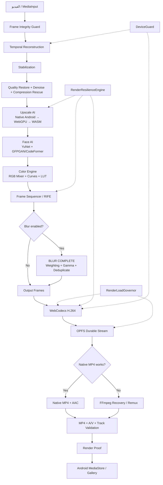

# BARSA SHOPI v9.0 — مخطط البنية

## قاعدة البنية
- لا إسقاط فريمات لتخفيف الحمل.
- لا تغيير output resolution أو FPS خلف ظهر المستخدم.
- لا تبديل model مختار يدوياً أثناء render.
- عند فشل backend: fallback آمن ومسجل.
- عند فشل MP4 native: استعادة عبر FFmpeg من elementary stream.
